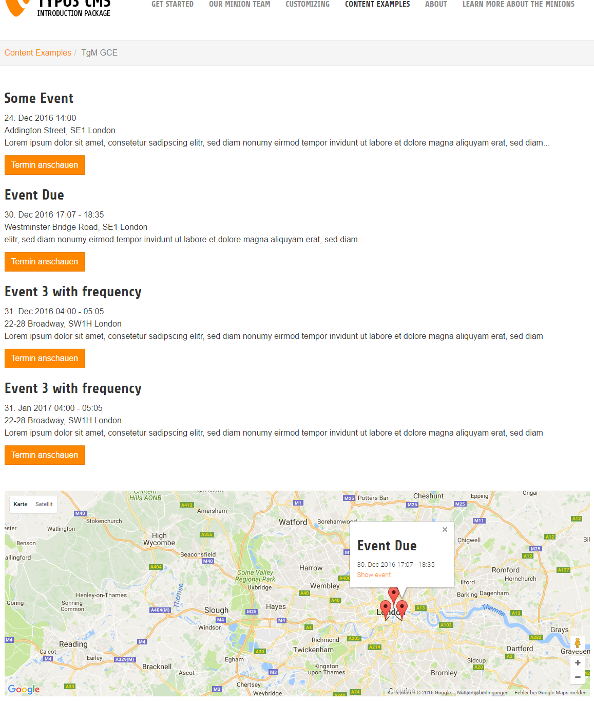
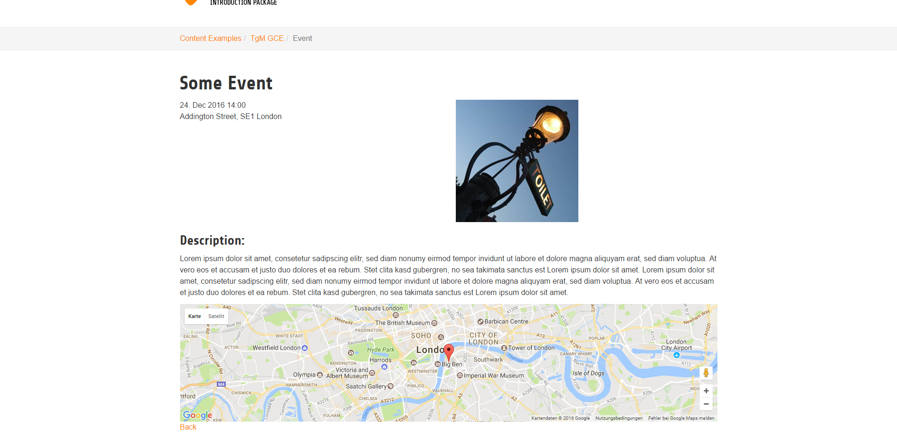
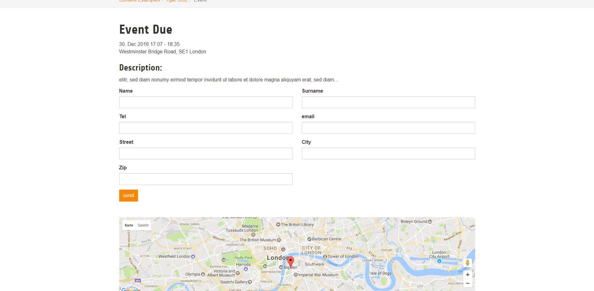

.. ==================================================
.. FOR YOUR INFORMATION
.. --------------------------------------------------
.. -*- coding: utf-8 -*- with BOM.

.. include:: ../Includes.txt

.. _introduction:

Introduction
============

.. _what-it-does:

What does it do?
----------------
- This extension give you the possibility to create simple events(title, description, image and contact data ) and show this events on a google map.
- The events support features like frequency from the calendarize extension created by Loch Müller (great work!)
- You can add quite easily a fluid form to your event. Its fluid, so you can customize it at pleasure.
- The E-Mail templates (receiver,costumer), for the event forms, are fluid as well and are fully customizable.
- The Google map that shows the events can be used standalone.
- You can add some costum group (like a tag) to your event and than filter by that in the plugin
   e.g. you have one group of events for London and one for Manchester. In that case you can use two plugins and show the events distinctly
- The Plugins can filter the events by TYPO3 categories

.. _screenshots:

Screenshots
-----------
Some screeeeenshots :)

   The list view with map (caption of the image)

   The detail view (caption of the image)

   The detail view with form (caption of the image)

