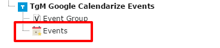

.. ==================================================
.. FOR YOUR INFORMATION
.. --------------------------------------------------
.. -*- coding: utf-8 -*- with BOM.

.. include:: ../Includes.txt

.. _user-manual:

Users Manual
============

Create your first event
-----------------------
When you have finished the configuration it is quite simple add your events.

- Go to your sysfolder where your events should be stored.
- Then switch to the list module and then add a new record.
- Then click on the events icon

   Event Icon

Now you should be in the event mask, here you have to fill all fields marked as required(red icons) after that you can save the record.
Now the event should be listed.